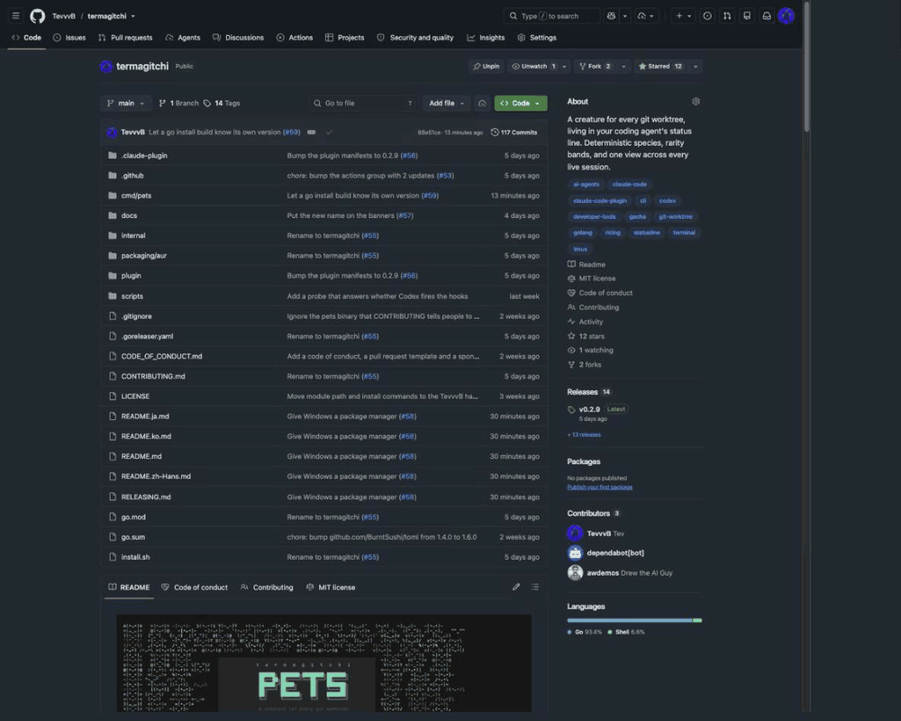

<p align="center">
  
</p>

<p align="center">
  <strong>A creature for every agent session. Hatch them, collect them, and never lose
  track of which agent is which.</strong>
</p>

<p align="center">
  <b>English</b> ·
  <a href="README.ja.md">日本語</a> ·
  <a href="README.ko.md">한국어</a> ·
  <a href="README.zh-Hans.md">简体中文</a>
</p>

<p align="center">
  Most terminal pets belong to <i>you</i>: one creature, nurtured over time. This one belongs
  to an <b>agent</b>. Every worktree is a den named after a city, every agent working in it
  hatches its own creature, and its mood tracks how tidy that worktree is. Six agents means
  six creatures alive at once, each recognisable at a glance, so you always know which session
  you are looking at and which one is in trouble.
</p>

<p align="center">
  There are <b>41 species across five rarity bands</b>, with shiny variants and 16 cities to
  work in. A creature is a hash of the session, so nothing is picked and nothing is saved -
  you get what you roll. Running more agents in more worktrees is how the collection fills,
  and <code>pets den</code> is where you see what you have found.
</p>

<div align="center">
  <a href="LICENSE"></a>
  <a href="https://github.com/TevvvB/termagitchi/releases"></a>
  <a href="https://buymeacoffee.com/tevvvb"></a>
  <p><sub><i>If you like, I like coffee :)</i></sub></p>
</div>

<p align="center">
  
</p>

## Install

**Linux and macOS**

```sh
curl -fsSL https://raw.githubusercontent.com/TevvvB/termagitchi/main/install.sh | sh
pets install
```

**macOS with Homebrew**

```sh
brew install TevvvB/tap/termagitchi
pets install
```

**As a Claude Code plugin** - adds `/pets` and `/pets-setup`, so it is findable
from inside Claude Code:

```
/plugin marketplace add TevvvB/termagitchi
/plugin install pets@termagitchi
/pets-setup
```

The plugin carries the two skills; `pets install` still owns the status line and
hooks, which is what `/pets-setup` runs. You need the binary either way - a plugin
carries configuration, not executables. See [plugin/README.md](plugin/README.md).

**Windows** - `scoop bucket add tevvvb https://github.com/TevvvB/scoop-bucket`
then `scoop install termagitchi`, and run `pets install`. Or grab an archive from
[Releases](https://github.com/TevvvB/termagitchi/releases) and put `pets` on your
`PATH` yourself.

**With Go** - `go install github.com/TevvvB/termagitchi/cmd/pets@latest`

`pets install` finds the agents you have and wires itself in, backing up any
config it touches and leaving your other settings alone. Start a new session
afterwards. `pets uninstall` reverses it.

If an agent is installed but has never been run, it has no config directory yet,
so name it directly: `pets install --harness=claude`.

## Star termagitchi

If a creature in your status line makes running several agents at once a little
easier to keep straight, a star helps other people find it.

<p align="center">
  
</p>

## Updating

| Installed with | Update with |
|---|---|
| Homebrew | `brew update && brew upgrade termagitchi` |
| The install script | re-run it, it replaces the binary in place |
| Go | `go install github.com/TevvvB/termagitchi/cmd/pets@latest` |
| A release archive | download the new one |

`brew update` first is not optional. Without it Homebrew reads its cached copy of the
tap and answers *"the latest version is already installed"* while installing the old
one, which is worse than an error because nothing looks wrong.

Homebrew refuses to upgrade a cask from a tap it does not trust, so the first
upgrade may stop with *"Refusing to load cask ... from untrusted tap"*. Trust it
once and it will not ask again:

```sh
brew trust TevvvB/tap
```

`pets card`, `pets party` and `pets den` check once a day whether a newer
release exists and print a line if so. Nothing else ever does: no hook and
nothing on the status line path touches the network. Turn it off with
`check = false` under `[update]`.

## Supported agents

| Agent | What you get |
|---|---|
| Claude Code | Full: live status line, hatch, quips |
| Codex CLI | Hooks work, but Codex must trust them first - see below. No status line there, so use the shell snippet for the pet |
| tmux or your shell prompt | Full pet, works with **any** agent |
| Editors | `pets render --format=json` to build your own |

The tmux and shell options need nothing from the agent, so they work with Aider,
Amp, Gemini CLI, or anything else. `pets install` prints the snippets.

Claude Code is the only agent this has been verified against end to end. If you
run something else and it works, or does not, please open an issue.

**Codex hooks have to be trusted before they run.** This is the thing to know, and nothing
tells you: Codex will not execute a new or changed hook until you accept it, an untrusted hook
is completely silent, and `codex doctor` does not mention hooks at all. So a fresh
`pets install --harness=codex` looks like it worked and does nothing until you say yes on the
next session start. Verified on Codex 0.149.0 - the same config fires only when run with
`--dangerously-bypass-hook-trust`.

Once trusted it works: Codex's payloads carry `session_id`, which is what a creature is keyed
on, so agents register and `pets den` and `pets party` fill up as they do under Claude Code.
There is no `workspace` object in a Codex payload, so the den name comes from git instead.

## Reading it

| Glyph | Meaning |
|---|---|
| `@ DXB` | the den: which worktree, as a flight code |
| `•ᴗ•` `•_•` `¬_¬` `>_<` `@_@` `x_x` | mood, five hearts down to zero |
| `7△` | 7 uncommitted files |
| `3↑` | 3 unpushed commits |
| `105↓` | commits behind trunk, shown past 40, costs nothing |
| `⑂2` | 2 heads in one migration tree |
| `✗` | last test or lint run failed |
| `-.-` with `·····` | still waking up, in the first second of a session |
| `· 72%` | how full that agent's context window is, on its row in `pets party` and `pets card`. Dim until 80%, then it warns. Absent when the harness does not report one |

You start at five hearts and lose one for any uncommitted file, another past 15,
one for any unpushed commit, another past 5, and two for a failing test run. All
of it is configurable.

Test results are only recorded when a runner says outright how it went, and a
result older than two hours is forgotten, so a red mark never haunts a branch
you already fixed.

Mood belongs to the worktree, so every agent working in one shares it. Context fill is
the exception: it is per agent, which is why it sits on the agent's row rather than in
the face.

## Seeing every worktree at once

```
  pets party                              4 dens · 3 agents

  @PAR (•_•)     otter ✦     refactor/auth-guard  ♥♥♥♥♡  3△
       (•_•)     otter     fix the flaky auth test               just now
       /•_•\     cat       audit the session middleware          just now
  @SYD -[•_•]-   carp  ✦     spike/wasm-build     ♥♥♥♥♡  9△
       -[•_•]-   carp      port the wasm build to esbuild        just now
  @MEX {•ᴗ•}     fox   ✦     chore/bump-deps      ♥♥♥♥♥
  @IST \(•ᴗ•)/   crow  ✦✦✦   docs/api-reference   ♥♥♥♥♥

  worst: otter · uncommitted
```

Worst first, so whatever needs attention is at the top. Dens with agents in them
list who is there, with the session's own name, so two agents sharing a worktree
are two creatures rather than one. Empty dens still show a creature. Long lists
are trimmed; `pets party --all` shows everything.

## Collecting them

Open a branch you have never opened before and its creature hatches. Species are
banded by rarity:

| Band | Odds | |
|---|---|---|
| common | 60% | `✦` |
| uncommon | 25% | `✦✦` |
| rare | 11% | `✦✦✦` |
| legendary | 3.5% | `✦✦✦✦` |
| mythic | 0.5% | `✦✦✦✦✦` |

Anything rare or above wears its band's colour, so you can see what you rolled
without counting stars. Commons and uncommons take a hue of their own, which is
what keeps two branches on the same creature telling apart.

Shiny is a separate 1-in-128 roll, so even a common can be a find. `pets den`
shows your collection.

A creature belongs to an agent and lasts as long as that session does, so
starting a session is a fresh roll. Dens are the stable half: the same repo and
worktree resolve to the same city on any machine, with nothing stored, and a den
remembers every agent that has worked in it even after they have moved on.

## Commands

| | |
|---|---|
| `pets party [--all]` | every live worktree, worst first |
| `pets den` | your collection |
| `pets card [path]` | full readout for one worktree |
| `pets render [--format=…]` | `statusline`, `tmux`, `title` or `json` |
| `pets install` / `pets uninstall` | wire into your agents |
| `pets version` | |

## Configuration

Optional, in `~/.config/pets/config.toml`.

```toml
[branch]
# Detected from your remote; set only to override.
# default = "origin/trunk"

[update]
# Once a day, and only from card, party and den.
check = true

[score]
dirty_many_at = 15
unpushed_many_at = 5
tests_failing = 2

[display]
party_limit = 12

[signals]
enabled = ["dirty", "unpushed", "behind", "tests"]

# Off by default. Turn on if your project uses Alembic or Django migrations,
# and the pet will warn you when a tree has split into two heads.
[signals.migrations]
enabled = false
penalty = 2
```

### Teaching it your stack

Any executable that prints `key=value` lines is a signal. Drop it in
`~/.config/pets/signals/`. It gets the worktree path as its first argument.

```sh
#!/bin/sh
# ~/.config/pets/signals/cargo.sh
echo "clippy=$(cargo clippy --message-format=short 2>&1 | grep -c '^warning')"
echo "coverage=$(grep -o '[0-9]*' target/coverage 2>/dev/null || echo 100)"
```

That much shows up on `pets card`. To make it reach the pet's face, give it a rule:

```toml
[signals.external.penalties.clippy]
over = 0      # bad when it goes up
cost = 1

[signals.external.penalties.coverage]
under = 80    # bad when it goes down
cost = 2
```

Two bounds, because half of what people measure is bad going up and half is bad
going down. A signal with no rule stays display-only, and a signal that did not
report is not treated as reporting zero, so a probe that fails to run cannot
sadden the pet on its own.

## Contributing

Two things are easy to contribute. A **creature** is one line in a slice, with a
name, the two fragments that bracket its face, and a rarity band. A **signal**
is any executable that prints `key=value`, so teaching the pet to read your
stack takes four lines of shell and no Go at all.

See [CONTRIBUTING.md](CONTRIBUTING.md). Issues and pull requests welcome.

## Licence

MIT. See [LICENSE](LICENSE).
