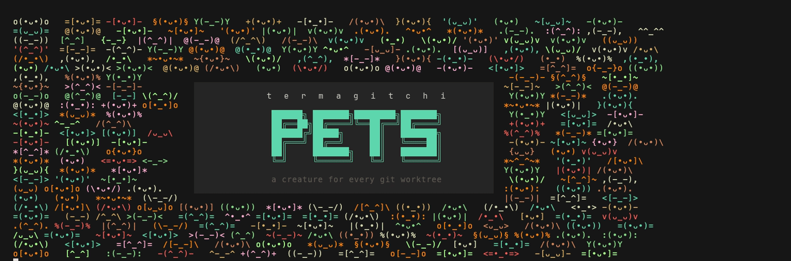

<p align="center">
  
</p>

<p align="center">
  <strong>每个 agent 一只小生物，每个 git worktree 一个巢穴（den）。</strong>
</p>

<p align="center">
  <a href="README.md">English</a> ·
  <a href="README.ja.md">日本語</a> ·
  <a href="README.ko.md">한국어</a> ·
  <b>简体中文</b>
</p>

<p align="center">
  常见的终端宠物属于 <i>你</i>：养一只，慢慢陪着你。这个不一样。
  这里的宠物属于 <b>agent</b>。每个 worktree 会变成一个有名字的巢穴，
  在里面运行的每个 agent 各有一只自己的小生物，它的心情反映那个 worktree 有多干净。
  同时跑六个 agent，就有六只小生物同时活着，一眼就能分辨，
  所以你随时知道自己在看哪个会话、哪个出了问题。
</p>

<p align="center">
  
</p>

## 安装

**Linux 和 macOS**

```sh
curl -fsSL https://raw.githubusercontent.com/TevvvB/termagitchi/main/install.sh | sh
pets install
```

**macOS（Homebrew）**

```sh
brew install TevvvB/tap/termagitchi
pets install
```

**Windows** — 先 `scoop bucket add tevvvb https://github.com/TevvvB/scoop-bucket`，
再 `scoop install termagitchi`，然后运行 `pets install`。
也可以从 [Releases](https://github.com/TevvvB/termagitchi/releases) 下载压缩包，
自己把 `pets` 放到 `PATH` 里。

**用 Go 安装** — `go install github.com/TevvvB/termagitchi/cmd/pets@latest`

`pets install` 会找到你装了哪些 agent 并把自己接进去。它改动过的配置会先备份，
其他设置保持原样。装完之后开一个新会话。`pets uninstall` 可以还原。

如果某个 agent 装了但从没运行过，它还没有配置目录，
这时直接指定即可：`pets install --harness=claude`。

## 怎么读

| 符号 | 含义 |
|---|---|
| `@ DXB` | 巢穴（den），用机场代码表示是哪个 worktree |
| `•ᴗ•` `•_•` `¬_¬` `>_<` `@_@` `x_x` | 心情，从五颗心到零 |
| `7△` | 7 个未提交的文件 |
| `3↑` | 3 个未推送的提交 |
| `105↓` | 落后 trunk 的提交数，超过 40 才显示 |
| `⑂2` | 迁移树里有 2 个 head |
| `✗` | 最近一次测试或 lint 失败 |
| `-.-` 加 `·····` | 会话刚开始，还没睡醒 |

从五颗心开始：有未提交文件扣 1，超过 15 个再扣 1；有未推送提交扣 1，超过 5 个再扣 1；
测试失败扣 2。这些都可以配置。

只有当 runner 明确说明结果时才会记录测试结果，且超过两小时的结果会被遗忘，
所以红色标记不会一直挂在你早就修好的分支上。

## 一次看到所有 worktree

```
  pets party                              4 dens · 3 agents

  @PAR (•_•)     otter ✦     refactor/auth-guard  ♥♥♥♥♡  3△
       (•_•)     otter     fix the flaky auth test               just now
       /•_•\     cat       audit the session middleware          just now
  @SYD -[•_•]-   carp  ✦     spike/wasm-build     ♥♥♥♥♡  9△
       -[•_•]-   carp      port the wasm build to esbuild        just now
  @MEX {•ᴗ•}     fox   ✦     chore/bump-deps      ♥♥♥♥♥
  @IST \(•ᴗ•)/   crow  ✦✦✦   docs/api-reference   ♥♥♥♥♥

  worst: otter · uncommitted
```

最糟的排在最前面，所以最该处理的一眼就看到。有 agent 的巢穴会列出里面都有谁，
并带上会话自己的名字，所以共用同一个 worktree 的两个 agent 是两只小生物而不是一只。
空的巢穴也有小生物。列表太长会截断，`pets party --all` 显示全部。

## 收集

这是扭蛋。小生物按会话孵化，所以每开一个新的 worktree 就等于抽一次。稀有度分五档：

| 稀有度 | 概率 | |
|---|---|---|
| common | 60% | `✦` |
| uncommon | 25% | `✦✦` |
| rare | 11% | `✦✦✦` |
| legendary | 3.5% | `✦✦✦✦` |
| mythic | 0.5% | `✦✦✦✦✦` |

rare 及以上会穿上所属稀有度的颜色，不用数星星就知道抽到了什么。
common 和 uncommon 各自分到独立色调，所以同一个物种也能区分开。

闪光（shiny）是独立的 1/128 抽取，所以就算是 common 也可能是好东西。
`pets den` 查看你的收集进度。

小生物属于 agent，只在那个会话存续期间活着，也就是说每开一个会话都是一次新的抽取。
巢穴是稳定的那一半：同样的仓库加 worktree，在任何机器上都会解析成同一座城市，
而且不存任何东西。巢穴还会记住在里面工作过的每个 agent，即使它们已经离开。

## 命令

| | |
|---|---|
| `pets party [--all]` | 所有活着的 worktree，最糟的在前 |
| `pets den` | 你的收集 |
| `pets card [path]` | 单个 worktree 的完整信息 |
| `pets render [--format=…]` | `statusline` / `tmux` / `title` / `json` |
| `pets install` / `pets uninstall` | 接入或移除 |
| `pets version` | |

## 支持的 agent

| Agent | 支持程度 |
|---|---|
| Claude Code | 完整支持：状态栏、孵化、吐槽 |
| Codex CLI | 钩子写好了但没在真实环境验证过。宠物显示请用下面的 shell 方案 |
| tmux / shell 提示符 | 完整支持，**任何** agent 都能用 |
| 编辑器 | 用 `pets render --format=json` 自己做 |

tmux 和 shell 这两种方式不需要 agent 提供任何东西，所以 Aider、Amp、Gemini CLI 都能用。
端到端验证过的只有 Claude Code。如果你用别的跑通了、或者没跑通，欢迎提 issue。

## 许可证

MIT，见 [LICENSE](LICENSE)。

---

> 此翻译基于英文版机器翻译。如果有读起来别扭的地方，
> 欢迎通过 [issue](https://github.com/TevvvB/termagitchi/issues) 或 PR 指正。
